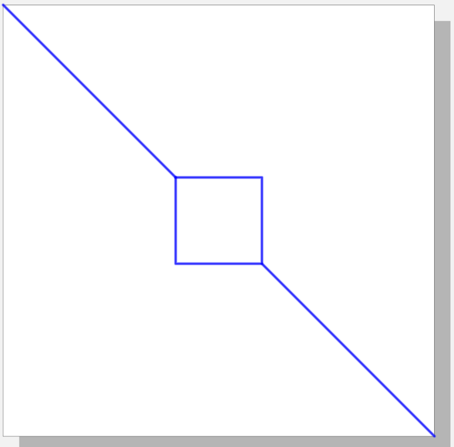
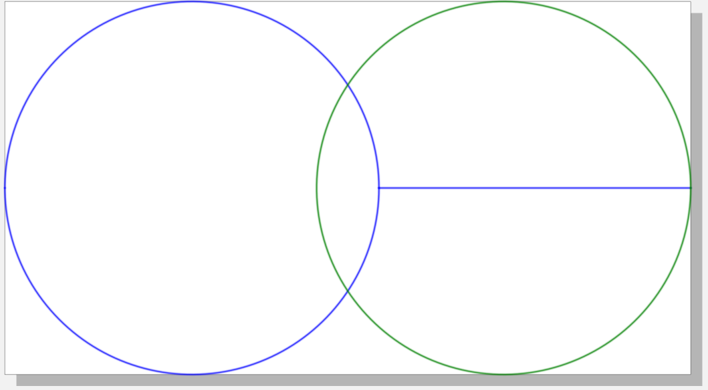

# occult

[`vpype`](https://github.com/abey79/vpype) plug-in to remove lines occulted by polygons from SVG files.


## Examples


### Basic usage

Draw a line, then a square:


`vpype line 0 0 5cm 5cm rect 2cm 2cm 1cm 1cm show`


Same drawing, after applying `occult`:


`vpype line 0 0 5cm 5cm rect 2cm 2cm 1cm 1cm occult show`




Order of path is important: `occult` will consider the last geometry in a SVG file to be "on top" of all other geometries,
the last but one is above every other geometries except the last one.
For instance, using `vpype rect 2cm 2cm 1cm 1cm occult show` will not modify geometries.


### Working with multiple layers


By default, `occult` performs occlusion layer by layer. For instance, applying occlusion
on the image below will not change anything:


`occult -i` ignores layers, so that occlusion is performed on all objects, regardless of their layer.
Geometries in layers with a larger ID number are considered to be "on top" of geometries in layers
with a smaller ID number.

- Without `-i` flag


- With `-i` flag


### Save occulted lines

`occult -k` keeps occulted lines in a separate layers.

- Without `-k` flag  



- With `-k` flag  


Using vpype's viewer (`show` command), you can visualize occulted lines and remaining lines separately.


## Using occult with Vsketch

`occult` can be invoked from a [Vksetch](https://vsketch.readthedocs.io/en/latest/) sketch, using `vsk.vpype("occult")`. When using the GUI, calling `occult` within the sketch `draw()` method will display occulted geometries at each code save / seed change. For sketches with lots of geometries, occlusion can take a significant amount of time. Invoke `occult` within the `finalize()` method of a sketch to perform occlusion only when saving a specific output.


```py
import vsketch

class Sketch(vsketch.SketchClass):
    def draw(self, vsk: vsketch.Vsketch):
        vsk.size('10x10cm')
        vsk.scale('mm')
        
        vsk.line(-5, -5, 5, 5)
        vsk.circle(0, 0, 3)

        # Uncomment to perform occlusion at every GUI reload
        # vsk.vpype("occult")
  
    def finalize(self, vsk: vsketch.Vsketch) -> None:
        # Occlusion (and other vpype commands) invoked only when saving
        vsk.vpype("linesimplify occult linemerge linesort")


if __name__ == "__main__":
    Sketch.display()
```


## Installation

See the [installation instructions](https://vpype.readthedocs.io/en/latest/install.html) for information on how
to install `vpype`.


### Existing `vpype` installation

If *vpype* was installed using pipx, use the following command:

```bash
$ pipx inject vpype git+https://github.com/LoicGoulefert/occult
```

If *vpype* was installed using pip in a virtual environment, activate the virtual environment and use the following command:

```bash
$ pip install git+https://github.com/LoicGoulefert/occult.git#egg=occult
```

Check that your install is successful:

```
$ vpype --help
Usage: vpype [OPTIONS] COMMAND1 [ARGS]... [COMMAND2 [ARGS]...]...

Options:
  -v, --verbose
  -I, --include PATH  Load commands from a command file.
  --help              Show this message and exit.

Commands:
[...]
  Plugins:
    occult
[...]
```

### Stand-alone installation

Use this method if you need to edit this project. First, clone the project:

```bash
$ git clone https://github.com/LoicGoulefert/occult.git
$ cd occult
```

Create a virtual environment:

```bash
$ python3 -m venv venv
$ source venv/bin/activate
$ pip install --upgrade pip
```

Install `occult` and its dependencies (including `vpype`):

```bash
$ pip install -e .
```

Check that your install is successful:

```
$ vpype --help
Usage: vpype [OPTIONS] COMMAND1 [ARGS]... [COMMAND2 [ARGS]...]...

Options:
  -v, --verbose
  -I, --include PATH  Load commands from a command file.
  --help              Show this message and exit.

Commands:
[...]
  Plugins:
    occult
[...]
```


## Documentation

The complete plug-in documentation is available directly in the CLI help:

```bash
$ vpype occult --help
```


## License

See the [LICENSE](LICENSE) file for details.
